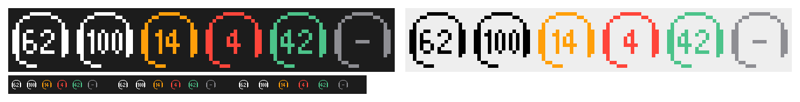

# HS80 Battery

A tiny Windows tray app that shows the battery level of a **Corsair HS80 RGB Wireless** headset
in the taskbar, without iCUE. One ~28 KB exe with no dependencies (it targets .NET Framework 4.8,
which ships with Windows).



- The icon is a headset (with the HS80's flip-up mic) around the battery percentage, drawn as
  16×16 pixel art so it stays sharp at tray size. Everything takes one colour: white or black to
  match the taskbar theme, orange at 15% or less, red at 5% or less, green while charging, grey
  with `-` when the headset is off or the receiver is unplugged.
- Hover for the exact state; double-click or use *Refresh now* to read it immediately
  (otherwise it reads every 10 s and after resuming from sleep).
- A one-off notification when the battery drops to 15%.
- *Start with Windows* in the menu (an `HKCU\…\Run` entry pointing at wherever the exe lives).

## Build

```powershell
.\build.ps1          # dist\HS80Battery.exe
.\build.ps1 -Probe   # also dist\probe.exe (HID diagnostics)
.\tools\preview.ps1  # dist\preview.png with every icon state, plus assets\hs80.ico
```

Windows 11 puts new tray icons in the `^` overflow: drag it onto the taskbar, or turn it on in
*Settings → Personalization → Taskbar → Other system tray icons*.

## How the battery is read

The USB receiver (`VID 1B1C`, `PID 0A6B`) exposes a vendor-defined HID collection
(usage page `0xFF42`, usage `1`, 64-byte reports) that speaks Corsair's property protocol,
known as *Bragi*. The app only sends reads (`GET`), so the headset never has to be switched to
"software mode" and its lighting and settings are left alone.

| Request (report 0x02) | Reply (report 0x01) | Meaning                                    |
|-----------------------|---------------------|--------------------------------------------|
| `02 09 02 0F`         | `01 01 02 00 76 02` | level: `0x0276` = 630 → 63.0%              |
| `02 09 02 10`         | `01 01 02 00 02 00` | status: 1 charging, 2 in use, 3 full (?)   |

`09` targets the wireless headset (`08` would be the receiver itself) and `02` is GET. Byte 3 of
the reply is a status code (`00` = OK, non-zero when the headset is off), and the value follows
in little-endian from byte 4. Charging (1) and in use (2) have been checked on a real headset;
full (3) is still an assumption.

The protocol comes from [OpenLinkHub](https://github.com/jurkovic-nikola/OpenLinkHub)
(`src/devices/hs80rgbW`) and
[HeadsetControl PR #570](https://github.com/Sapd/HeadsetControl/pull/570), and was verified
against a real HS80 with `probe.exe`.

## Do I still need iCUE?

Not for this app. Without iCUE you lose firmware updates, EQ, sidetone, and RGB/auto-off
settings that aren't stored on the headset itself; audio keeps working through Windows' generic
USB audio driver.
